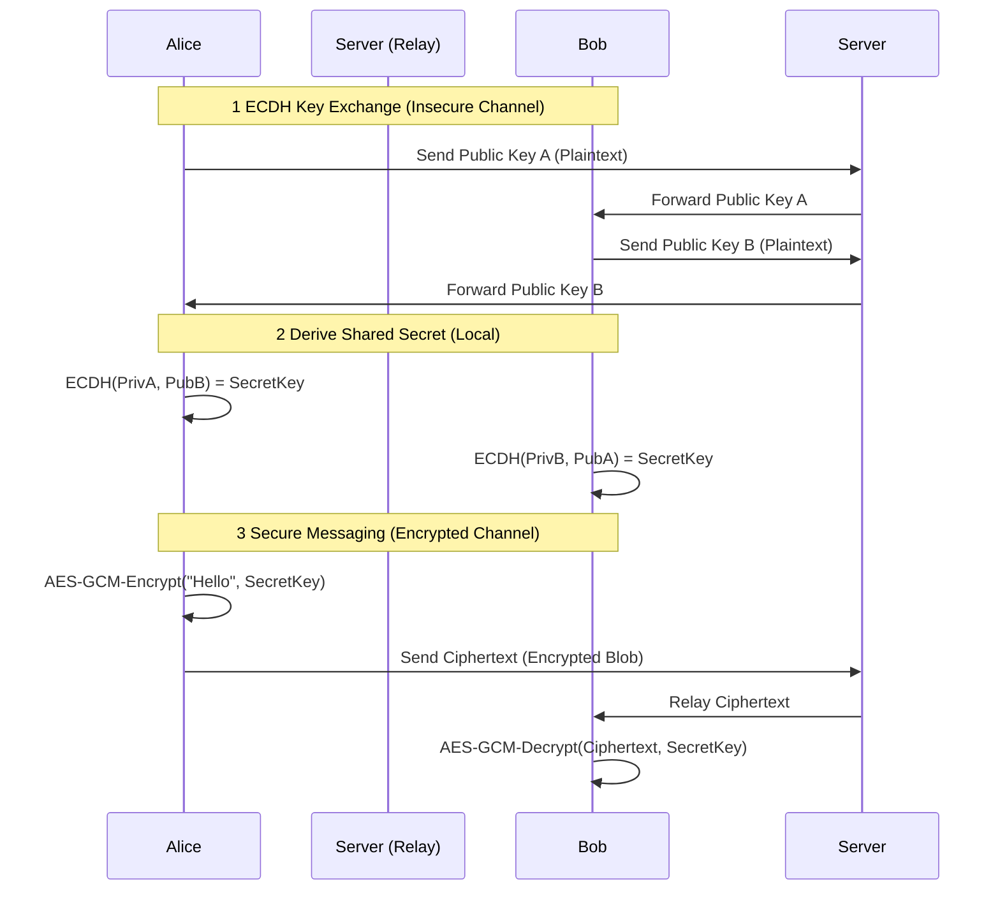
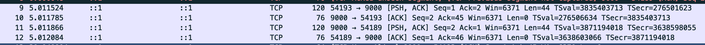
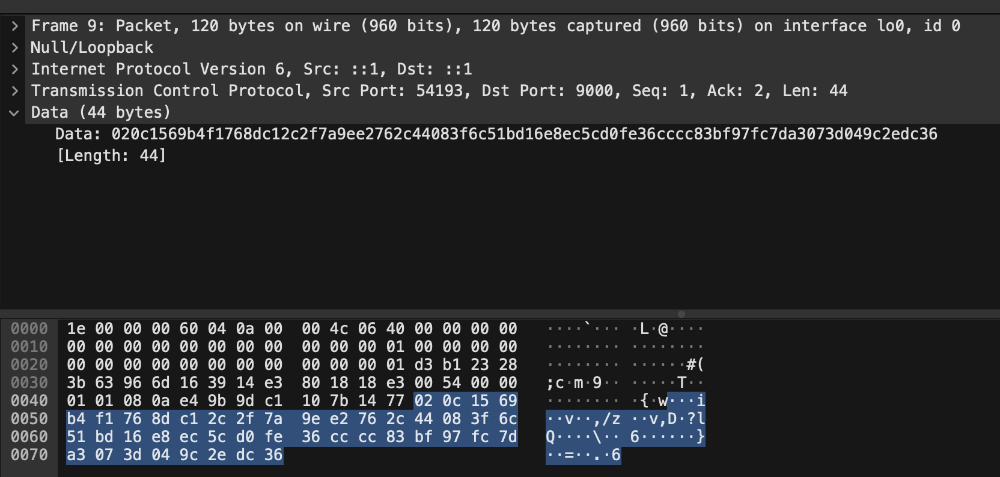
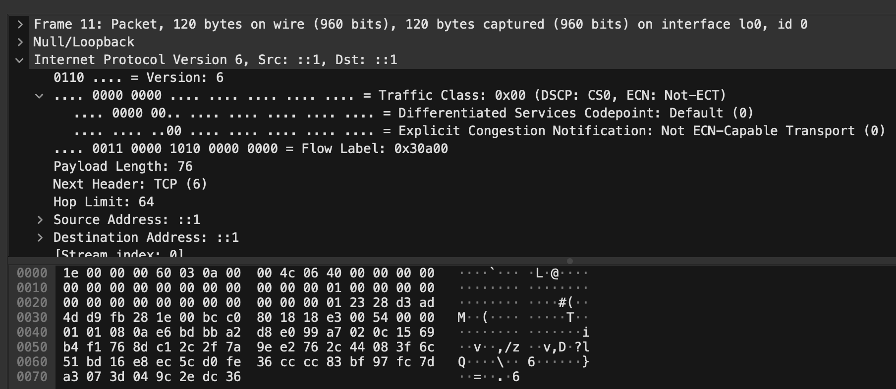

# 📁 Project: SecretTalk

### : Go E2E 메신저

## 1 프로젝트 개요 (Overview)

- **개발 기간**: 2025-11-12 ~ 2025-11-14
- **한줄 소개**: 중앙 서버가 메시지 내용을 절대 복호화할 수 없는 안전한 1:1 보안 채팅 시스템
- **개발 동기**:
    - 기존 메신저들의 중앙 집중형 데이터 저장 방식에 대한 보안 우려 해소
    - 서버를 '신뢰할 수 없는 엔티티(Untrusted Entity)'로 가정하고, 오직 클라이언트 단에서만 데이터가 평문으로 존재하는 **Zero-Knowledge 아키텍처**를 직접 구현해보고자 함
    - 스니핑(Sniffing)에 안전한 프로토콜을 설계

### 프로젝트 폴더 구조

```text
SecretTalk/
├── go.mod
├── cmd/
│   ├── server/
│   │   └── main.go      # Zero-Knowledge 중계 서버
│   └── client/
│       └── main.go      # 암호화 메신저 클라이언트
└── pkg/
    └── crypto/
        └── crypto.go    # ECDH 및 AES-GCM 핵심 모듈

```

## 2 사용 기술 (Tech Stack)

- **Language**: Go (Golang) - *동시성 처리(Goroutine) 및 메모리 안전성 활용*
- **Network**: TCP Socket Programming (Custom Binary Protocol)
- **Cryptography**:
    - **Key Exchange**: ECDH (Elliptic Curve Diffie-Hellman, NIST P-256)
    - **Encryption**: AES-256-GCM (Galois/Counter Mode) - *기밀성 및 무결성 동시 보장*
    - **RNG**: `crypto/rand` (Cryptographically Secure Pseudo-Random Number Generator)
- **Tools**: Wireshark (패킷 분석 및 보안성 검증)

## 3 핵심 기능 및 보안 설계 (Key Features)

### 1. Zero-Knowledge Relay Architecture

- **서버의 역할 최소화**: 서버는 클라이언트 A와 B 사이에서 바이트 배열(`[]byte`)을 전달하는 '단순 파이프(Relay)' 역할만 수행
- **복호화 불가능**: 서버 코드 내에 복호화 로직(Decrypt)이 전무하며, 키 교환 과정에서도 개인키(Private Key)가 네트워크를 타지 않으므로 서버 관리자도 대화 내용을 볼 수 없음

### 2. 안전한 키 교환 (ECDH Handshake)

- 사용자 접속 시 `crypto/ecdh` 패키지를 이용해 일회성 공개키 쌍을 생성
- 네트워크상으로는 **공개키(Public Key)**만 전송되며, 각 클라이언트는 자신의 개인키와 상대의 공개키를 조합해 **공유 비밀키(Shared Secret)**를 로컬에서 유도함

### 3. 강력한 암호화 (AES-256-GCM)

- 단순 기밀성(Confidentiality)만 제공하는 AES-CBC 대신, 데이터 변조 여부(Integrity)까지 검증할 수 있는 **AES-GCM** 모드 채택
- 메시지 전송 시마다 고유한 **Nonce**를 생성하여 암호화 강도 확보
- **메타데이터 보호**: 사용자 닉네임까지 페이로드에 포함하여 통째로 암호화함으로써, 공격자가 "누가 대화하는지"조차 식별 불가능하게 설계

## 4. 시스템 아키텍처 (Architecture)
본 프로젝트의 핵심 통신 흐름은 아래 시퀀스 다이어그램과 같이 동작합니다 서버는 클라이언트 간의 메시지를 중계하는 역할만 수행하며, 메시지 내용에는 접근할 수 없습니다



**상세 설명:**
1. **ECDH 키 교환 (Insecure Channel)**:
    - Alice와 Bob은 각자 생성한 공개키(`PubA`, `PubB`)를 서버를 통해 교환합니다 이 과정에서 공개키 자체는 평문으로 전송되지만, 공개키만으로는 비밀키(`PrivA`, `PrivB`)를 유추할 수 없습니다
2. **공유 비밀키 유도 (Local)**:
    - 각 클라이언트는 자신의 개인키(`PrivA` 또는 `PrivB`)와 상대방의 공개키(`PubB` 또는 `PubA`)를 이용해 로컬에서 동일한 **공유 비밀키(`SecretKey`)**를 독립적으로 유도합니다 이 공유 비밀키는 네트워크를 통해 직접 전송되지 않으므로 중간자 공격에 안전합니다
3. **안전한 메시징 (Encrypted Channel)**:
    - 클라이언트는 유도된 공유 비밀키(`SecretKey`)를 사용하여 메시지를 AES-GCM 방식으로 암호화(`AES-GCM-Encrypt`)합니다 암호화된 메시지(`Ciphertext`)는 서버를 통해 전달되며, 서버는 이 암호문을 복호화할 수 없습니다
    - 수신 클라이언트는 동일한 공유 비밀키로 암호문을 복호화(`AES-GCM-Decrypt`)하여 원문 메시지를 얻습니다

## 5. 구현 상세 (Implementation Details)

### 커스텀 프로토콜 설계

TCP 스트림 위에서 효율적인 데이터 처리를 위해 바이너리 패킷 구조를 직접 설계

- **Type (1 Byte)**: 패킷 타입 구분
    - `0x01`: 공개키 교환용 (PubKey)
    - `0x02`: 암호화된 메시지 전송용 (Message)
- **Payload (N Bytes)**: 실제 전송 데이터 (공개키 바이트 또는 암호화된 메시지 본문)

### 주요 코드 로직 (Go)

- **암호화 엔진**: `pkg/crypto` 패키지로 모듈화하여 재사용성 증대
- **동시성 처리**: `cmd/server`에서 각 클라이언트 연결을 Goroutine으로 처리하여, 다수의 클라이언트가 동시에 메시지를 주고받아도 블로킹(Blocking) 없는 통신 구현

## 6. 검증 및 성과 (Verification & Results)

### Wireshark를 이용한 보안성 검증

로컬 루프백(`lo0`) 인터페이스에서 패킷을 캡처하여 **기밀성**과 **릴레이 아키텍처**를 직접 검증했습니다

#### 1 전체 통신 흐름 (Traffic Analysis)

- **Packet 9**: 클라이언트(Sender) $\rightarrow$ 서버 (44 bytes 전송)
- **Packet 11**: 서버 $\rightarrow$ 상대방 클라이언트(Receiver) (44 bytes 중계)
- 서버는 데이터를 처리하거나 머무르게 하지 않고, 즉시 대상에게 전달(Relay)하는 패턴을 보입니다

#### 2 페이로드 암호화 검증 (Payload Encryption)

**[Client $\rightarrow$ Server]**

- **Hex Dump**: `02 0c 15 69 ...`
- 첫 바이트 `0x02`는 프로토콜상 `TypeMsg`를 의미합니다
- 이어지는 데이터는 AES-256-GCM으로 암호화되어 있어, 닉네임이나 메시지 원문을 전혀 식별할 수 없습니다(Garbage Value)

**[Server $\rightarrow$ Peer]**

- 서버가 상대방에게 전달하는 패킷의 데이터(`02 0c 15 69 ...`)가 송신자의 패킷과 완전히 동일합니다
- 이는 서버가 중간에서 데이터를 변조하거나(Tampering) 복호화하지 않고, **투명한 파이프(Transparent Pipe)** 역할만 수행함을 입증합니다

> **[결론]** 중간자(MITM)나 악의적인 서버 관리자가 패킷을 스니핑하더라도, ECDH로 합의된 공유 비밀키 없이는 대화 내용을 절대 복호화할 수 없습니다

## 7. 실행 방법 (How to Run)

### 사전 준비

1. **Go 설치**: Go 1.21 이상 버전이 시스템에 설치되어 있어야 합니다
2. **Go 모듈 초기화 및 의존성 다운로드**: 프로젝트 루트 디렉토리에서 다음 명령어를 실행하여 Go 모듈을 초기화하고 필요한 의존성을 다운로드합니다
    ```bash
    go mod tidy
    ```

### 실행 단계

총 세 개의 터미널이 필요합니다 각 터미널에서 프로젝트 루트 디렉토리(`SecretTalk/`)로 이동하여 다음 명령어를 순서대로 실행합니다

#### 1. 서버 실행 (Terminal 1)

```bash
go run cmd/server/main.go
```
- 서버가 `localhost:9000`에서 클라이언트 연결을 기다립니다

#### 2. 클라이언트 A 실행 (Terminal 2)

새로운 터미널 탭 또는 창을 열고, 다음 명령어를 실행합니다

```bash
go run cmd/client/main.go
```
- 닉네임을 입력하라는 프롬프트가 나타나면 원하는 닉네임을 입력합니다
- `Command> /connect`를 입력하여 키 교환을 시작합니다

#### 3 클라이언트 B 실행 (Terminal 3)

또 다른 터미널 탭 또는 창을 열고, 다음 명령어를 실행합니다

```bash
go run cmd/client/main.go
```
- 마찬가지로 닉네임을 입력하고, `Command> /connect`를 입력합니다

#### 채팅 시작

- 두 클라이언트 모두 `/connect` 명령을 입력하고 상대방이 접속하면 `[System] Secure Channel Established!` 메시지가 나타납니다
- 이제 안전하게 암호화된 메시지를 주고받을 수 있습니다
